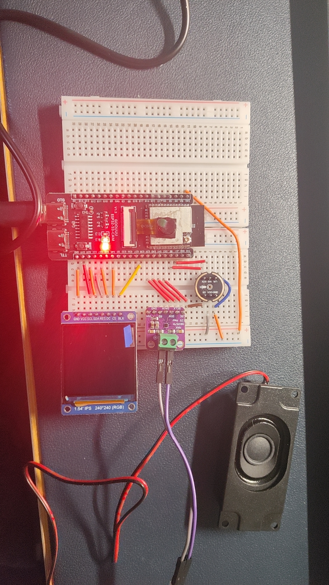

# 媒体展示 Gallery

本目录用于记录小智AI机器人的组装过程和效果展示。

---

## 📷 组装过程照片

| 阶段 | 描述 | 预览 |
|------|------|------|
| 配件全家福 | 所需全部配件展示 |  |
| 焊接完成 | 焊接完成的主板 |  |
| 整体组装 | 完整组装效果 |  |
| 上电测试 | 首次上电开机 |  |
| 成品展示 | 最终成品多角度展示 |  |

> 📌 **添加照片**：将照片放入 `media/photos/` 目录，命名如 `01_parts.jpg`

---

## 🎬 演示视频

| 演示内容 | 链接 | 说明 |
|----------|------|------|
| 语音对话演示 | [查看视频](链接地址) | 测试问答功能 |
| 唤醒词测试 | [查看视频](链接地址) | "小智小智"唤醒测试 |
| 表情展示 | [查看视频](链接地址) | OLED/LCD表情动画 |
| 声纹识别 | [查看视频](链接地址) | 不同人声识别效果 |

> 📌 **添加视频**：上传到B站/YouTube后在此表格中添加链接

---

## 📸 精彩瞬间


> 在这里添加你对机器人功能的感悟或者组装过程中的小故事

---

## 📁 文件结构

```
media/
├── photos/        # 组装过程照片
│   ├── 01_parts.jpg
│   ├── 02_soldered.jpg
│   ├── 03_assembled.jpg
│   └── ...
└── videos/        # 演示视频 (建议使用外部链接)
```

---

## ⚡ 快速开始

### 添加照片

将照片放入 `media/photos/` 目录，建议：
- 格式：JPG/PNG
- 分辨率：1920x1080 以下
- 命名：`01_description.jpg`

### 添加视频

**方案A：Git LFS（推荐）**
```bash
git lfs install
git lfs track "*.mp4"
git add media/videos/*.mp4
git commit -m "Add demo videos"
```

**方案B：外部链接**
将视频上传到B站/YouTube，在上方表格中添加链接。

---

## ⚠️ 注意事项

- 照片建议使用 WebP 格式减小体积
- 视频建议压缩后上传，或使用外部链接
- 遵循项目许可证，不要上传侵犯版权的内容
